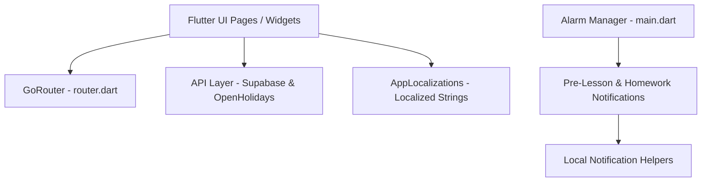

# SchoolMate Technical Deep Dive (gemini.md)

This file details the architectural decisions, code workflows, algorithms, and system integrations of **SchoolMate**. It is designed to get AI agents and human developers quickly oriented with the core patterns of the codebase.

---

## 🗺️ System Architecture

SchoolMate uses a decoupled structure where page states directly interact with backend services (via Supabase) and external endpoints. 



### 1. Routing System (`lib/util/router.dart`)
We use **GoRouter** for handling application routes. 
- The routes are defined in [router.dart](file:///D:/Programmierung/Android/Projects/SchoolMate/lib/util/router.dart).
- Navigation is tracked using a `NavigationTreeObserver` to maintain screen hierarchies and breadcrumbs.
- Common paths:
  - `/` -> Authentication handler
  - `/home` -> Core dashboard
  - `/schedule` -> Classroom schedule/calendar
  - `/homework` -> Homework task manager
  - `/marks` -> Grades calculation overview

### 2. State & Database Layer (`lib/API/`)
The app integrates with **Supabase** for database operations and user management:
- **Client Configuration**: Initialized in `main.dart` at startup.
- **APIs**:
  - `grades/` -> Manages grading scales (e.g. percentage vs. numeric).
  - `homeworks/` -> Handles additions, completions, and deletions of homework tasks.
  - `schedule/` -> Handles lesson planning and schedules.
  - `auth/` -> Manages authentication status and local session details.

### 3. Background Action & Notification Cycle
To keep students notified of their upcoming tasks without having the app constantly in the foreground:
- **Alarm Manager**: `android_alarm_manager_plus` runs a callback `scheduleTaskCallback` registered on boot.
- **Daily Update**: A background alarm triggers every day shortly after midnight.
- **Execution Flow**:
  1. Re-initialize Supabase client if needed.
  2. Fetch the current day's school schedule.
  3. Pre-calculate notification fire times for lessons (e.g., 5-15 minutes before class starts).
  4. Fetch open homework tasks and queue daily reminders.
  5. Schedule the next day's alarm at midnight.

---

## 🌎 Localization (l10n) Architecture

SchoolMate does not use standard synthetic packages in `.dart_tool`. Instead, localization code is output directly into `lib/l10n/` via configurations in [l10n.yaml](file:///D:/Programmierung/Android/Projects/SchoolMate/l10n.yaml):

- **Files**:
  - [app_en.arb](file:///D:/Programmierung/Android/Projects/SchoolMate/lib/l10n/app_en.arb): English templates.
  - [app_de.arb](file:///D:/Programmierung/Android/Projects/SchoolMate/lib/l10n/app_de.arb): German templates.
- **Importing**:
  Always use:
  ```dart
  import 'package:school_mate/l10n/app_localizations.dart';
  ```
  Instead of:
  ```dart
  import 'package:flutter_gen/gen_l10n/app_localizations.dart'; // DO NOT USE
  ```
- **Language Detection in external APIs**:
  When calling holiday calendars (OpenHolidays API), pass the system locale's language code:
  ```dart
  Localizations.localeOf(context).languageCode
  ```

---

## 🧮 Custom Algorithms & Logic

### 1. 15-Point Grading and Color Scale
SchoolMate computes grade health and visually colors grades depending on whether a student's system uses a **standard scale (1.0 to 6.0, lower is better)** or a **points scale (0 to 15, higher is better)**:
- **Scale Types**: 
  - Standard scale: `isReversed = false`
  - 15-point scale: `isReversed = true`
- **Dynamic Color Calculation**:
  A grade/mark's rating is normalized between `0.0` (failing/worst) and `1.0` (outstanding/best). The application interpolates between `Colors.red` (0.0) and `Colors.green` (1.0) using this normalized ratio to output a visually representative gradient mark box.

### 2. Schedule Overlap Detection (`test/unit_tests/overlapping_TimeOfDay_test.dart`)
To prevent schedule conflicts when adding new lessons, the application evaluates overlapping `TimeOfDay` ranges:
- **Logic**: Evaluates arrays of `[startTime, endTime]` to check for active overlaps.
- **Edge cases covered**:
  - Unsorted class start times.
  - Back-to-back classes (start time of class B equals end time of class A - *not treated as overlap*).
  - Multi-range intervals containing gaps.

---

## 🗒️ Guidelines for AI Code Generators

When modifying this repository:
1. **Never add state management packages (like Riverpod)** unless explicitly ordered to by the user. Use the local widget state lifecycle, `FutureBuilder`, and `StreamBuilder` streams.
2. **Localizations**: Ensure all user-facing text is defined in `lib/l10n/app_en.arb` and `lib/l10n/app_de.arb`, then run `flutter gen-l10n` to compile.
3. **Naming Convention**: Keep existing files in camelCase or TitleCase formats (e.g. `SettingsPage.dart`, `BottomNavBar.dart`) even if they raise linter info notices, as changing them could break dependency histories.
4. **Const Constructors**: When adding localized widgets (using `l10n.key`), make sure you remove any `const` modifiers from ancestor layouts.
